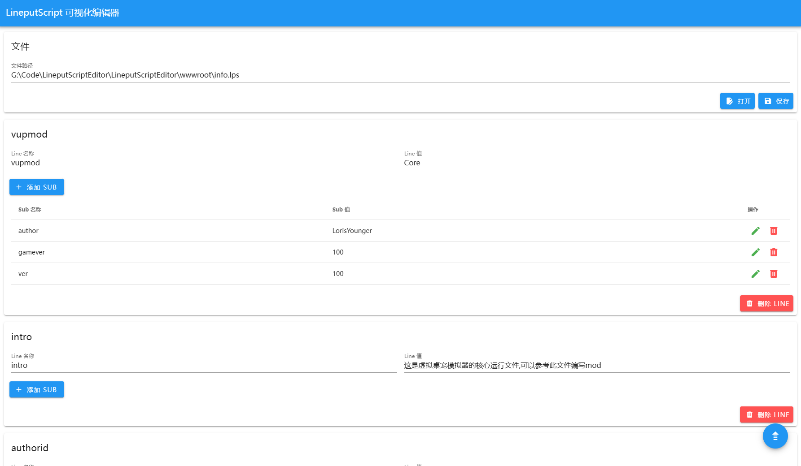

# LineputScriptEditor
LPS可视化编辑器,可以更方便的编写.lps文件

目前仅支持简单的双层文件，欢迎提供后续开放建议

## 亮点
更方便的编辑LinePutScript文件
支持表格模式 查看数据表更方便

## 使用方法

1. 运行 .exe 文件
2. 用浏览器打开 http://localhost:9003
3. 输入文件路径并打开

## 预览图

## 项目引用

MASA.Blazor: https://github.com/masastack/MASA.Blazor

LinePutScript: https://github.com/LorisYounger/LinePutScript

## 版权许可

[License MIT](/LittleFish-233/LineputScriptEditor/blob/master/LICENSE.txt)